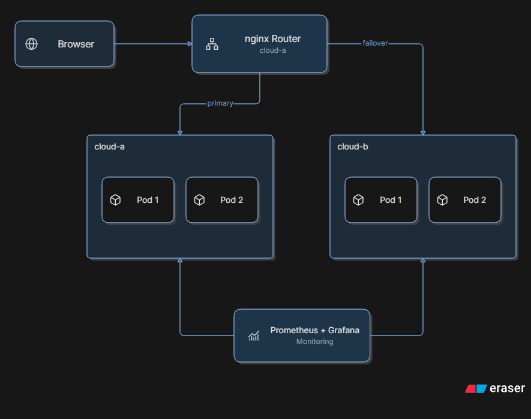

# TwinCluster

A multi-cluster Kubernetes deployment platform with automatic failover between two independent clusters.

## What It Does

TwinCluster runs the same application on two independent Kubernetes clusters. An nginx router sends traffic to the primary cluster, and if it becomes unhealthy, the router automatically fails over to the secondary cluster within 5 seconds.

## Tech Stack

Docker, Kubernetes, Terraform, GitHub Actions, nginx, Prometheus, Grafana, Trivy, Python/Flask.

## How to Run

1. Install: Docker, Kind, kubectl, Terraform, Helm
2. Create clusters: `cd terraform && terraform init && terraform apply`
3. Deploy to cloud-a: `kubectl config use-context kind-cloud-a && kubectl apply -f k8s/app/deployment-cloud-a.yaml && kubectl apply -f k8s/app/service.yaml`
4. Deploy to cloud-b: `kubectl config use-context kind-cloud-b && kubectl apply -f k8s/app/deployment-cloud-b.yaml && kubectl apply -f k8s/app/service.yaml`
5. Deploy router: `kubectl config use-context kind-cloud-a && kubectl apply -f k8s/router/`
6. Start three port-forwards on ports 9001, 9002, and 8080
7. Open http://localhost:8080

## Failover Demo

1. Open http://localhost:8080 — shows "Hello from kind-cloud-a!"
2. Stop the cloud-a port-forward (Ctrl+C)
3. Refresh the page after 5 seconds
4. Now shows "Hello from kind-cloud-b!"

## Monitoring

Prometheus + Grafana dashboards show live CPU, memory, and network metrics for the application pods.

## Cleanup

    kind delete cluster --name cloud-a
    kind delete cluster --name cloud-b